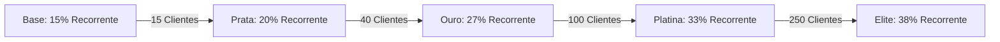

# Manual do Afiliado - Mindgest Partners Program
## Bem-vindo ao Programa de Parceiros Mindgest!

Este guia foi elaborado para te ajudar a compreender o funcionamento detalhado do nosso portal de afiliados, regras de comissões, níveis de progressão, carteira digital e levantamentos. 

---

## 1. O Modelo de Comissões

O nosso programa oferece incentivos financeiros atrativos e **comissões recorrentes** sobre as subscrições dos clientes que referires para o Mindgest.

### 💰 Estrutura Geral das Comissões

Para **todos os planos de subscrição** (BASE, SMART e PRO), o comissionamento segue as seguintes regras de base:

* **Primeiro Pagamento (Mensal ou Anual):** **20%** do valor pago pelo cliente no primeiro mês (ou na primeira anuidade).
* **Pagamentos Recorrentes (Mensalidades seguintes):** Começa em **15%** e pode subir até **38%** conforme o teu nível de parceiro (ver Tabela de Progressão abaixo).

---

## 2. Níveis de Parceiro e Upgrade de Comissão Recorrente

À medida que indicas mais clientes ativos, o teu nível de parceiro sobe automaticamente e a tua comissão recorrente aumenta. O volume de clientes ativos define a tua percentagem de ganho mensal em todos os planos:



### 📈 Tabela de Progressão Revista

| Nível | Ícone | Clientes Ativos | Comissão Recorrente | Bónus Adicional | Total Efetivo | Racional |
| :--- | :---: | :--- | :---: | :---: | :---: | :--- |
| **Base (None)** | ⚪ | < 15 clientes | 15% | 0% | **15%** | Alinhado com entrada de mercado |
| **Prata (Silver)** | 🥈 | 15 a 39 clientes | 18% | +2% | **20%** | Ligeira subida (evita esgotar margem cedo) |
| **Ouro (Gold)** | 🥇 | 40 a 99 clientes | 22% | +5% | **27%** | Salto real face à Prata |
| **Platina (Platinum)** | 💎 | 100 a 249 clientes | 26% | +7% | **33%** | Novo nível estratégico |
| **Elite (Elite)** | 👑 | 250+ clientes | 28% | +10% | **38%** | Só os parceiros verdadeiramente estratégicos |

> [!NOTE]
> Os clientes ativos são contabilizados de forma única por identificador de cliente (NIF). A progressão de nível é recalculada automaticamente a cada novo pagamento validado.

> [!IMPORTANT]
> O nível **Elite** requer 250 ou mais clientes ativos. Representa o topo estratégico do programa, reservado para parceiros de altíssimo volume.

---

## 3. Planos Disponíveis para Recomendação

Podes recomendar três planos principais aos teus clientes:

1. **Plano BASE (5.445,22 Kz/mês):** Ideal para pequenas empresas e profissionais singulares.
2. **Plano SMART (11.998,22 Kz/mês):** Plano completo com funcionalidades avançadas.
3. **Plano PRO (14.899,22 Kz/mês):** Plano corporativo de alto desempenho. 
   * *Apenas parceiros com Certificação Comercial ativa podem comercializar este plano.*

---

## 4. O Funcionamento da Carteira Digital (Wallet)

A tua carteira no portal está organizada em três saldos principais para garantir máxima transparência:

```
  +-------------------------------------------------------+
  |                   A TUA CARTEIRA                      |
  +-------------------------------------------------------+
  |  Saldo Pendente: Kz 25.000,00                         |  <-- Comissões em período de garantia
  |  (Em validação automática de 15 dias)                 |
  +-------------------------------------------------------+
  |  Saldo Disponível: Kz 45.000,00                       |  <-- Fundos prontos para levantamento
  +-------------------------------------------------------+
  |  Total Ganho: Kz 70.000,00 | Total Pago: Kz 0,00      |  <-- Histórico acumulado
  +-------------------------------------------------------+
```

### ⏱️ Período de Validação e Maturação (15 dias)
Sempre que o teu cliente referido efetua um pagamento, a comissão correspondente entra no teu **Saldo Pendente**.
* O sistema aguarda **15 dias** (período de garantia e ativação da subscrição).
* Após 15 dias, a comissão transita automaticamente do **Saldo Pendente** para o **Saldo Disponível**.

---

## 5. Como Levantar os Teus Ganhos

Quando tiveres fundos no **Saldo Disponível**, podes solicitar a transferência para a tua conta bancária.

> [!IMPORTANT]
> **Valor mínimo de levantamento: 8.000 Kz.** Não é possível submeter um pedido de levantamento abaixo deste valor.

### 📋 Passo a Passo para Levantamento:
1. Acede à secção **Carteira (Wallet)** no teu portal.
2. Clica em **Solicitar Levantamento**.
3. Escolhe o valor que pretendes levantar (mínimo 8.000 Kz). O valor será retido temporariamente do teu saldo disponível para processamento.
4. O administrador do sistema analisará o teu pedido:
   * **Aprovado:** O administrador realiza a transferência bancária e anexa o comprovativo da transação no teu painel. O valor transita para o histórico de *Total Levantado*.
   * **Rejeitado:** Se houver algum problema de dados ou IBAN incorreto, o pedido é cancelado e o dinheiro retorna imediatamente ao teu **Saldo Disponível** com uma justificação do administrador.

> [!WARNING]
> Certifica-te de preencher corretamente o teu Banco e IBAN nas definições de perfil para evitar atrasos ou rejeições nos pagamentos.

---

## 6. Certificação Comercial (Como Desbloquear o Plano PRO)

Os parceiros que atinjam o **Nível Prata (15+ clientes ativos)** tornam-se elegíveis para requerer a **Certificação Comercial**.

* **Benefícios:** Acesso à promoção do plano **PRO**, suporte comercial avançado e ferramentas exclusivas.
* **Processo:** Uma vez atingido o requisito de elegibilidade, podes submeter o pedido no teu painel. Um gestor da Mindware analisará a tua candidatura e ativará a tua conta como **Parceiro Comercial Certificado**.

---

## 7. Perguntas Frequentes (FAQ)

**O meu nível desce se perder clientes?**
Sim. O número de clientes ativos é recalculado periodicamente. Se ficar abaixo do limiar do teu nível atual, a comissão ajusta-se no processamento seguinte.

**Os clientes anuais contam para o meu nível?**
Sim, qualquer subscrição ativa (mensal ou anual) atribuída ao teu perfil conta para o total de clientes ativos.

**Quanto tempo demora um levantamento?**
Após submeter o pedido, a equipa financeira processa a transferência e associa o comprovativo ao teu painel. O tempo depende da disponibilidade bancária, geralmente 1-3 dias úteis.
